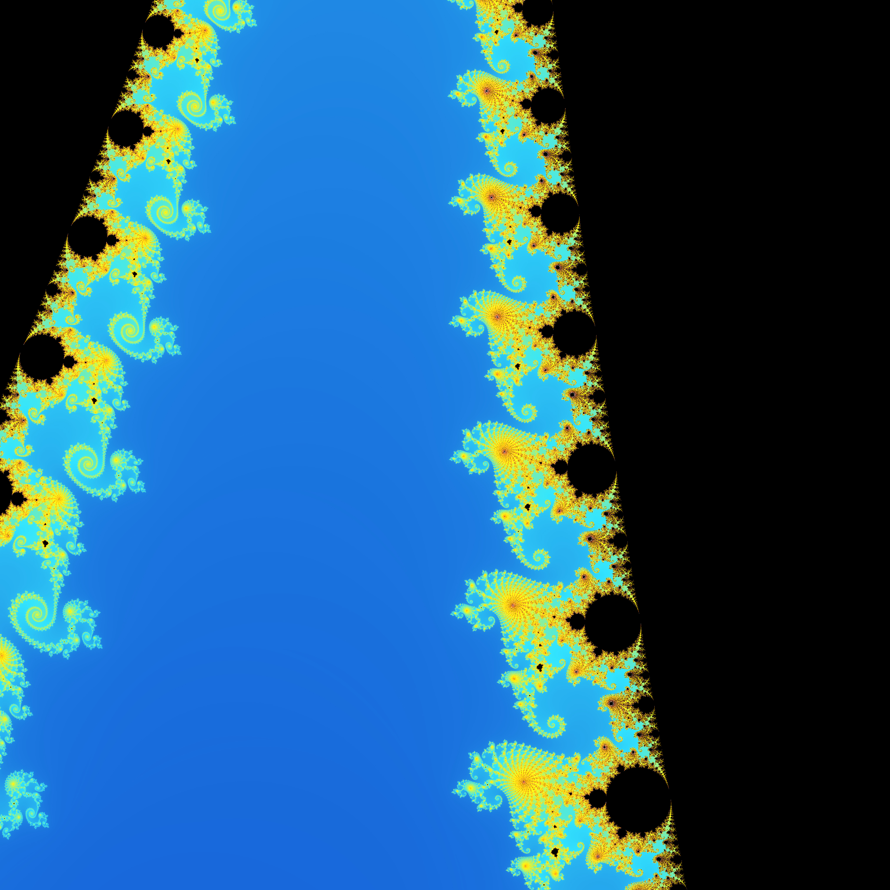

# cuda-foundations

A collection of CUDA programs written while learning GPU programming fundamentals — from kernel basics to image processing and fractal rendering.

## Projects

### Basic Kernels

| File | Description |
|------|-------------|
| `hello_cuda.cu` | Prints block and thread indices to explore the 3D CUDA execution model |
| `vector_addition.cu` | Parallel element-wise vector addition with explicit host/device memory management |
| `matrix_multiplication.cu` | Naive parallel matrix multiplication using a 2D thread grid |
| `matrix_multiplication_shared_memory.cu` | Tiled matrix multiplication using shared memory to reduce global memory bandwidth |

### Image Filters

GPU-accelerated image processing using [stb_image](https://github.com/nothings/stb) for I/O. Place `image.jpg` in the `image-filter/` directory before running.

| File | Description |
|------|-------------|
| `grayscale.cu` | Converts a color image to grayscale using standard luminance weighting (ITU-R BT.601) |
| `blur.cu` | Box blur with a configurable radius and per-pixel weight kernel |

### Mandelbrot Renderer

Generates a 4096×4096 PNG of the Mandelbrot set using the escape-time algorithm with smooth coloring and an interpolated blue-to-gold palette.



Several interesting regions are pre-defined in the source:

| Region | `center_x` | `center_y` | `zoom` |
|--------|------------|------------|--------|
| Default view | `-0.5` | `0.0` | `0.6` |
| Seahorse Valley | `-0.75` | `0.1` | `50.0` |
| Elephant Valley | `0.25` | `0.0` | `100.0` |
| Fractal Spirals | `-1.25066` | `0.02012` | `10000.0` |

## Requirements

- NVIDIA GPU with CUDA support
- [CUDA Toolkit](https://docs.nvidia.com/cuda/cuda-installation-guide-linux/) (tested with CUDA 12.x)
- `nvcc` compiler

## Building

Each `.cu` file is self-contained and can be compiled directly with `nvcc`.

```bash
# Basic kernels
nvcc -o hello_cuda basic-kernels/hello_cuda.cu
nvcc -o vector_addition basic-kernels/vector_addition.cu
nvcc -o matrix_multiplication basic-kernels/matrix_multiplication.cu
nvcc -o matrix_multiplication_shared basic-kernels/matrix_multiplication_shared_memory.cu

# Image filters (requires image.jpg in the image-filter/ directory)
nvcc -o grayscale image-filter/grayscale.cu
nvcc -o blur image-filter/blur.cu

# Mandelbrot renderer
nvcc -o mandelbrot mandelbrot/escape-time-algorithm.cu -lm
```

## Concepts Covered

- Thread and block indexing in 1D and 2D grids
- Host/device memory management (`cudaMalloc`, `cudaMemcpy`, `cudaFree`)
- CUDA error handling with `cudaGetErrorString`
- Shared memory and tiled computation for bandwidth reduction
- 2D kernel launches for image processing
- Smooth coloring and palette interpolation for fractal rendering

## License

MIT — see [LICENSE](LICENSE)
